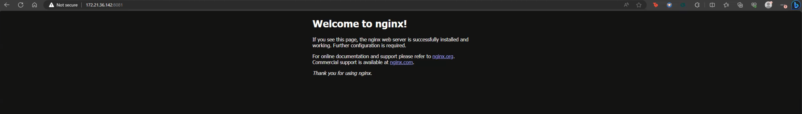
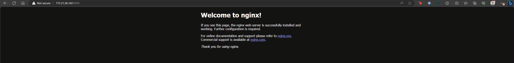
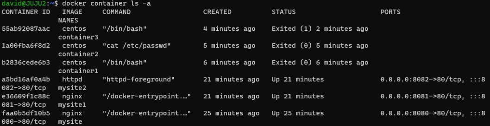

# Lab: Running Web Servers in a Docker Container

## 1. Running Web Servers in a Docker Container

- Running three nginx and one Apache web servers

```bash
docker container run -d -p 80:80 --name mysite1 nginx
docker container run -d -p 8080:80 --name mysite2 nginx
docker container run -d -p 8081:80 --name mysite3 nginx
docker container run -d -p 8082:80 --name mysite4 httpd
```

- Verify that the web servers, nginx, are running.

```bash
docker container ls
```

or

```bash
docker ps
```

- Enter the `ipaddress:port` of the server into a web browser to confirm its status.





## 2. Stopping a container

- use docker container stop `CONTAINER_ID|CONTAINER_NAME.` For example, the container_id of a running nginx web server is `d75a67d879fc`, and the container_name is `mysite3`

```bash
docker container stop 5d61a0c20fd9
```

- or use the command below to kill a container by name.

```bash
docker container stop mysite2
```

- stopping multiple containers using the first three characters of the `container_id`

```bash
docker container stop d75 553 6be 568
```

## 3. Remove a Running Container and Docker Image from Local

Example: removing a container image, `nginx`, and `hello-world` with running container_names: `mysite1 mysite2 mysite3 mysite4 mysite5` requires force `-f` removing the running containers before the images can be removed.



```bash
docker remove rm mysite1 mysite2 mysite3 mysite4 mysite5 -f
docker image rm nginx httpd hello-world
```

## 4. Removing Dangling Docker Images

Docker images consist of multiple layers, and dangling images are layers with no relationship to tagged images. Delete dangling images, stopped containers, and networks not used by at least one container. Run the commands below:

```bash
docker system prune -y
```
